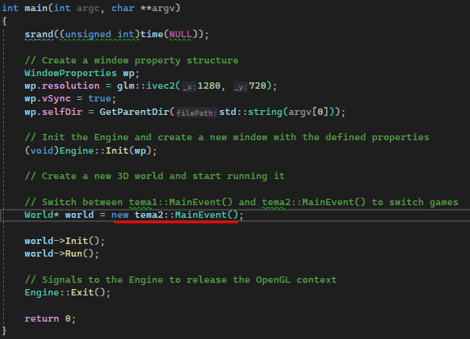

# Two simple OpenGL games
## Game 1: Duck Hunt

### Gameplay

The duck spawns randomly, behind a green rectangle (the grass), each time with a random position and rotation. By default, there are 8 levels of difficulty, with each difficulty the speed of the rate increases, the score for it and the dimensions are reduced to make it harder to have a hit on it. The duck's hitbox is a rectangle that encompasses the entire body (during the game you can press "H" to view it).

During flight, there is a 10 percent chance every second to change its direction angle even during flight (provided that the randomly chosen direction does not cause the rate to go outside the display area). We have 5 seconds to kill the duck, after which it will fly from the position in which the time expired exactly upwards, the sky will darken, signaling MISS. We have 3 bullets available for each duck, if we hit it with at least 1, the duck goes vertically down, and the sky will change its color signaling HIT. For every 5 ducks killed, the difficulty level increases. We have 3 lives available, and if we lose them all we will have a game over screen with the option to go to the menu or start a new game. 

There is also a button to pause the game "P". To exit the pause, type the same button and again we have 3 seconds until the game resumes. 

- Resize the window is disabled, so it will be played in the resolution with which the game was started
- The rate is built from several meshes, each mesh has a different modeling matrix
- At each moment of the game, the current score, difficulty, number of lives and bullets are displayed

## Game 2: Car Race

### Gameplay
This game is a simple one, in which we can move with the car, along with other dynamic obstacles on the track. The dynamic obstacles are represented by other cars, bots, which move along a predefined route upon collision with which our car will be stopped. On an attempt to leave the track, the player's car will be stopped.

For a more pleasant visual effect, an illusion of the curvature of the land was created with the help of shaders, which can be modified with the "+" or "-" keys.

To reset the curvature and view the flat map, we can type "R".

To view the predefined routes of the bots, as well as the edges of the track, we can type "T".

To move the car we use WASD. There is also the possibility of FreeCam, in which we can leave the car and fly on the map, for this we press "B", and to move the camera, we hold RMB and WASD.

## Switch between games
To choose which game to play, manually change from tema1::MainEvent() to tema2::MainEvent().

## Building
On Windows, you will need CMake and Visual Studio, where you will choose project directory and a build directory for the project (usually build in the root of the project), then press configure. Then put the check mark on "WITH_HOMEWORKS" option. After that press Generate and Open Project. That's it, press F5 to play.

## P.S.
These games were like assessment projects for the graphics course, in which I learned OpenGL and graphics elements on computers, using a framework provided by the coordinating team of this course. 

## Copyright
The rights to the [framework](https://github.com/UPB-Graphics/gfx-framework) used to develop these two small projects belong to the EGC team, the ACS faculty, UPB.
